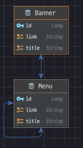

- 구성
  - 간단한 소스구성도
  - 테이블 안내
  - api 스팩 및 테스트 방법
  - 기타
---
- 구성:
  - 스프링부트 3.0.5 버전, 코틀린 으로 작성
  - jpa 와 h2: in-memory 방식으로 진행 함.
  - 테스트 코드 같이 작성.
- erd
  - 
- 테이블 정보:
  - banners 테이블
    - id: 배너 ID
    - title: 제목
    - link: 링크
    - menu: 해당 배너가 속한 메뉴
  - menus 테이블
    - id: 메뉴 ID
    - title: 제목
    - link: 링크
    - parent: 상위 메뉴
    - subMenus: 하위 메뉴 리스트
    - banners: 해당 메뉴의 배너 리스트
  - Menu 엔티티는 자신과 N:1 관계 하이라키 구조를 가지고 Banner 엔티티와는 1:N 의 관계를 가지도록 설계했습니다.

---
- api 스팩 및 테스트 방법
- 테스트 방법(리눅스)
  - 1.해당 소스에 있는 곳에 접속 후 "./gradlew build"
  - 2.빌드가 완료되면 해당 폴더로 이동합니다 "cd build/libs"
  - 3."java -jar global_menu-0.0.1-SNAPSHOT.jar" 명령어로 서버를 구동시켜줍니다.
  - 4.정상적으로 서버가 띄워지면 새로운 터미널 환경을 구동시켜 아래 api 스팩에 나열된 호출방법을 참고해서 명령어를 복사 붙여넣기를 합니다.
  - 5.테스트 성공 확인 및 완료.

```text
공통: 모든 response 값은 아래와 같은 기본 포맷으로 반환됩니다. *succees: true 를 제외하고 모든 것은 실패 입니다.
{
  "success": true or false,
  "message": null or String,
  "result": null or Json
}

1.메뉴 등록
메소드: POST

엔드포인트: /api/menus

요청 파라미터:
	title(필수): 메뉴 제목,
	link(필수): 메뉴 링크,
	parentId(선택): 상위 메뉴 ID

기타: parentId 가 있다면 최상위 메뉴, 없다면 하위 메뉴를 만듭니다.

호출방법:
	최상위 메뉴 만들기 + 배너 넣기: curl -H "Content-Type: application/json" -X POST -d '{"title": "샘플 상위 메뉴", "link": "/sample-menu"}' http://localhost:8080/api/menus
		curl --location --request POST 'http://localhost:8080/api/menus' \
		--header 'Content-Type: application/json' \
		--data-raw '{
		    "title": "New Menu",
		    "link": "/new-menu",
		    "banners": [
		        {
		            "title": "Banner 1",
		            "link": "/banner-1"
		        },
		        {
		            "title": "Banner 2",
		            "link": "/banner-2"
		        }
		    ]
		}'

	하위 메뉴 만들기: 
		curl --location --request POST 'http://localhost:8080/api/menus' \
		--header 'Content-Type: application/json' \
		--data-raw '{
		    "title": "New Submenu",
		    "link": "/new-submenu",
		    "parentId": 1
		}'

결과값:
	최상위 메뉴 만들기 + 배너결과:
		{
		  "success": true,
		  "message": null,
		  "result": {
		    "id": 21,
		    "title": "New Menu",
		    "link": "/new-menu",
		    "parentId": null,
		    "subMenus": [],
		    "banners": [
		      {
		        "id": 4,
		        "title": "Banner 1",
		        "link": "/banner-1",
		        "menuId": 21
		      },
		      {
		        "id": 5,
		        "title": "Banner 2",
		        "link": "/banner-2",
		        "menuId": 21
		      }
		    ]
		  }
		}

	하위 메뉴 만들기 결과:
		{
		  "success": true,
		  "message": null,
		  "result": {
		    "id": 22,
		    "title": "New Submenu",
		    "link": "/new-submenu",
		    "parentId": 1,
		    "subMenus": [],
		    "banners": []
		  }
		}


2.메뉴 수정
메소드: PUT

엔드포인트: /api/menus/{id}

요청 파라미터:
	id(필수): 수정할 메뉴 ID,
	title(필수): 메뉴 제목,
	link(필수): 메뉴 링크,
	parentId(선택): 상위 메뉴 ID

호출방법:
	최상위 배너 + 배너 업데이트
		curl --location --request PUT 'http://localhost:8080/api/menus/1' \
		--header 'Content-Type: application/json' \
		--data-raw '{
		    "title": "Updated Menu Title",
		    "link": "https://www.updatedmenu.com",
		    "banners": [
		        {
		            "title": "Banner Title 1 - Updated",
		            "link": "https://www.updatedbanner1.com"
		        },
		        {
		            "title": "Banner Title 2 - Updated",
		            "link": "https://www.updatedbanner2.com"
		        }
		    ]
		}'

	하위메뉴 업데이트
		curl --location --request PUT 'http://localhost:8080/api/menus/2' \
		--header 'Content-Type: application/json' \
		--data-raw '{
		    "title": "New sub-menu",
		    "link": "/new-submenu-link",
		    "parentId": 1
		}'


결과값: 
	최상위 배너 + 배너 업데이트:
		{
		  "success": true,
		  "message": null,
		  "result": {
		    "id": 1,
		    "title": "Updated Menu Title",
		    "link": "https://www.updatedmenu.com",
		    "parentId": null,
		    "subMenus": [
		      {
		        "id": 2,
		        "title": "New sub-menu",
		        "link": "/new-submenu-link",
		        "parentId": 1,
		        "subMenus": [],
		        "banners": []
		      },
		      ...
		    ],
		    "banners": [
		      {
		        "id": 10,
		        "title": "Banner Title 1 - Updated",
		        "link": "https://www.updatedbanner1.com",
		        "menuId": 1
		      },
		      ...

	하위 배너 업데이트:
		{
		  "success": true,
		  "message": null,
		  "result": {
		    "id": 2,
		    "title": "New sub-menu",
		    "link": "/new-submenu-link",
		    "parentId": 1,
		    "subMenus": [],
		    "banners": []
		  }
		}


3.메뉴 삭제
메소드: DELETE

엔드포인트: /api/menus/{id}

요청 파라미터:
	id(필수): 삭제할 메뉴 ID

기타: 최상위 삭제시 하위 모두 삭제

호출방법:
	curl -X DELETE http://localhost:8080/api/menus/1

결과값:
	{"success":true,"message":null,"result":null}


4.상위 메뉴를 사용하여 하위 메뉴 찾기
메소드: GET

엔드포인트: /api/menus/{parentId}/sub-menus

요청 파라미터:
	parentId(필수): 상위 메뉴 ID

호출방법:
	curl -X GET http://localhost:8080/api/menus/1/sub-menus

결과값: 하위 메뉴 목록.
	{
	  "success": true,
	  "message": null,
	  "result": [
	    {
	      "id": 2,
	      "title": "Sub Menu 1 of Top Menu 1",
	      "link": "/top-menu-1/sub-menu-1",
	      "parentId": 1,
	      "subMenus": [],
	      "banners": []
	    },
	    {
	      "id": 3,
	      "title": "Sub Menu 2 of Top Menu 1",
	      "link": "/top-menu-1/sub-menu-2",
	      "parentId": 1,
	      "subMenus": [],
	      "banners": []
	    },
	    {
	      "id": 4,
	      "title": "Sub Menu 3 of Top Menu 1",
	      "link": "/top-menu-1/sub-menu-3",
	      "parentId": 1,
	      "subMenus": [],
	      "banners": []
	    }
	  ]
	}
	결과값이 없을 경우: {"success":true,"message":null,"result":[]}

```
 